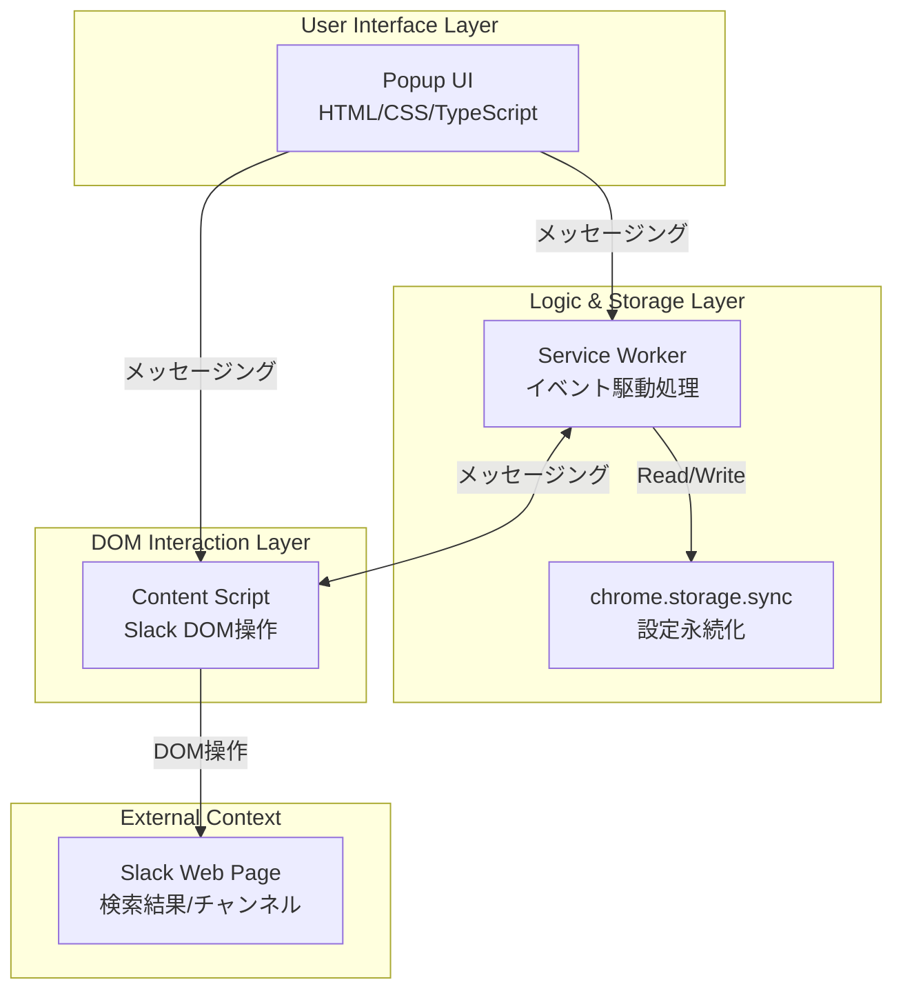
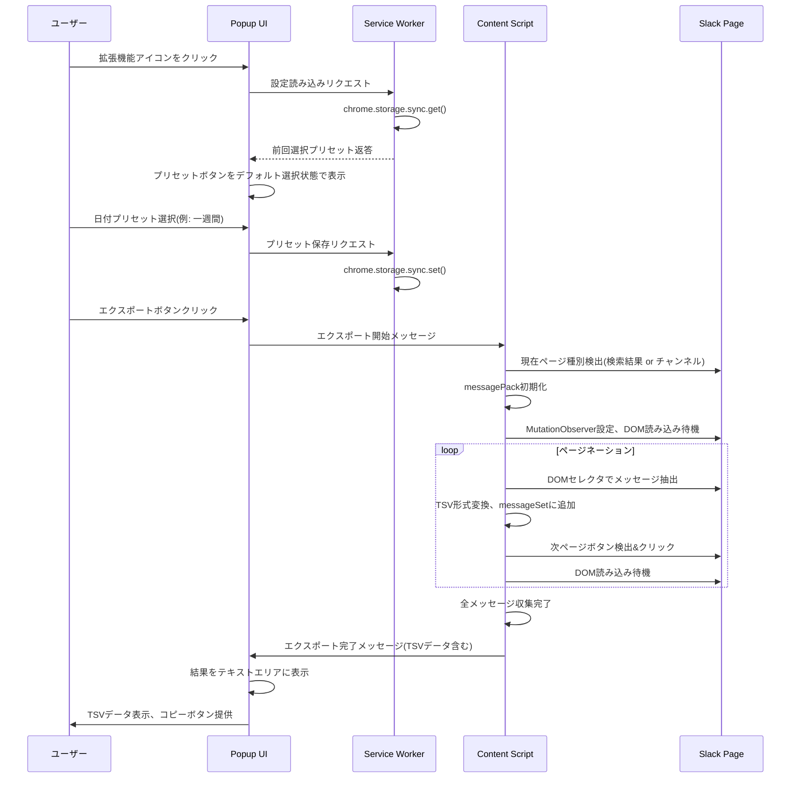
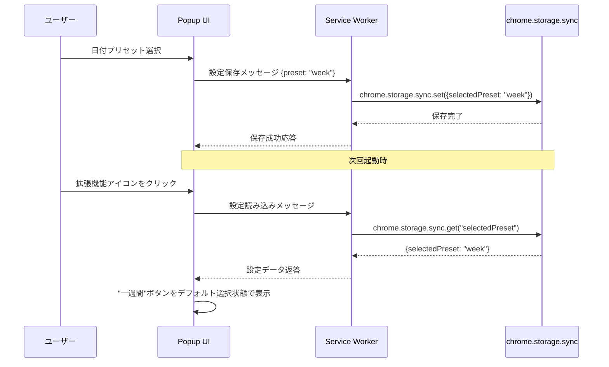

# Design Document

## Overview

本機能は、既存のSlack検索結果エクスポート用ブックマークレット(421行のJavaScript実装)をChrome拡張機能として再実装し、新たに日付フィルタプリセット機能、ユーザー設定永続化機能、チャンネルページエクスポート機能を追加する。Chrome Extension Manifest V3アーキテクチャに準拠し、Content Script(DOM操作層)、Service Worker(ロジック層)、Popup UI(プレゼンテーション層)の3層構造を採用する。

**Purpose**: Slackユーザーに対し、検索結果とチャンネルメッセージをTSV形式でワンクリックエクスポートする機能と、日付範囲フィルタのプリセット機能を提供する。既存のブックマークレット実装を継承しつつ、Chrome拡張機能ならではの設定永続化とクロスデバイス同期を実現する。

**Users**: Slackワークスペースでメッセージ検索やチャンネル閲覧を行う全ユーザー。特に、検索結果の分析、データアーカイブ、オフライン参照を必要とするユーザーが対象。

**Impact**: 現在のブックマークレット方式(手動実行、設定保存なし)から、拡張機能方式(アイコンクリック、設定自動保存、クロスデバイス同期)へと移行する。既存のブックマークレットユーザーは拡張機能インストール後、同等以上の機能を利用可能。

### Goals

- 既存ブックマークレット機能(検索結果ページネーション、TSVエクスポート、ポップアップ表示)をChrome Extension として完全再現
- 日付フィルタプリセット(当日/昨日/一週間/一ヶ月)機能の追加とプリセット選択の永続化
- チャンネルページメッセージのエクスポート機能追加
- Chrome Manifest V3ベストプラクティスに準拠した型安全でメンテナンス性の高い実装
- 既存のPlaywright E2EテストスイートをChrome Extension環境に適応し、継続的な品質保証を実現

### Non-Goals

- Firefox, Safari等の他ブラウザ対応(Chromium系ブラウザのみサポート)
- Slack APIを使用したサーバーサイドエクスポート機能(完全クライアントサイド処理を維持)
- リアルタイム同期やバックグラウンド自動エクスポート(ユーザー操作トリガーのみ)
- SlackのUI/UX拡張機能(エクスポート機能のみに特化、Slack UIへの侵襲的変更なし)
- エクスポートデータのクラウド保存やサーバー送信(ローカルポップアップ表示とクリップボードコピーのみ)

## Architecture

### Existing Architecture Analysis

**現在のブックマークレット実装**:
- **パターン**: 単一JavaScriptファイル(IIFE構造)、421行のvanilla JavaScript
- **制約**: グローバルスコープ汚染回避、ページ読み込み後の手動実行、状態保存なし
- **コア機能**:
  - `getMessage()`: 再帰的ページネーション制御
  - `createPromiseWaitSearchResult()`: MutationObserverによるDOM読み込み待機
  - `createPromiseGetMessages()`: DOMセレクタによるメッセージ抽出(タイムスタンプ、チャンネル、送信者、本文)
  - `createPromiseClickNextButton()`: 次ページボタンクリック
  - `showMessagesPopup()`: TSVデータをポップアップウィンドウに表示
- **データ構造**: `messagePack` オブジェクト(`messages`配列、`messageSet`でSet重複排除、`hasNextPage`フラグ)
- **DOMセレクタ**: `[role="document"]`(メッセージグループ)、`.c-search_message__content`、`.c-timestamp`など
- **セキュリティ**: XSSエスケープ処理、不正プロトコルフィルタリング実装済み

**移行方針**:
- DOM操作ロジックは Content Script に移植(MutationObserver、セレクタ、ページネーション制御を保持)
- 新機能(日付プリセット、設定管理)は Service Worker と Popup UI に実装
- TypeScript strict mode で型安全性確保、既存テストスイート(Playwright)を Chrome Extension 環境に適応

### Architecture Pattern & Boundary Map

**選択パターン**: Layered MV3 Pattern (Content Script + Service Worker + Popup UI の3層分離)

**Mermaid Diagram**:



**Architecture Integration**:
- **選択パターン**: Layered MV3 Pattern - Manifest V3必須要件とsteering原則(単一責任、境界明確化)に整合
- **Domain/feature boundaries**:
  - **Popup UI**: ユーザーインタラクション(日付プリセット選択、エクスポート実行、結果表示)
  - **Service Worker**: 設定管理(chrome.storage操作)、拡張機能ライフサイクル管理
  - **Content Script**: SlackページDOM操作、メッセージ抽出、ページネーション制御
- **既存パターン保持**: ブックマークレットのMutationObserverパターン、再帰的ページネーション、Set型重複排除
- **新コンポーネント**:
  - **DatePresetManager**: 日付プリセット計算とSlack検索クエリ生成(Service Worker内)
  - **SettingsManager**: chrome.storage.sync操作のラッパー(Service Worker内)
  - **MessageFormatter**: TSV形式変換とMarkdownリンク処理(Content Script内)
- **Steering準拠**: 単一責任原則(各層が明確な役割)、依存性逆転(Content ScriptはService Workerに依存するが、Service WorkerはContent Script実装詳細を知らない)

### Technology Stack

| Layer | Choice / Version | Role in Feature | Notes |
|-------|------------------|-----------------|-------|
| Extension Runtime | Chrome Manifest V3 | 拡張機能実行環境、Service Worker管理 | Chrome 90以降対応、WebExtensions API標準準拠 |
| Language | TypeScript 5.x (strict mode) | 型安全な実装、Chrome API型定義活用 | `@types/chrome` パッケージ使用、`any`型禁止 |
| Content Script | Vanilla JavaScript (TypeScript compiled) | Slack DOM操作、メッセージ抽出 | 既存ブックマークレットロジック移植、MutationObserver継続使用 |
| Service Worker | Vanilla JavaScript (TypeScript compiled) | 設定管理、イベント処理 | Event-driven、状態はStorageに永続化 |
| Storage | chrome.storage.sync API | 日付プリセット設定永続化 | 100KB quota、クロスデバイス同期対応 |
| UI Framework | Vanilla HTML/CSS/TypeScript | Popup UI実装 | フレームワーク不使用(軽量化、既存steering原則準拠) |
| Build Tool | TypeScript Compiler (tsc) | TypeScript → JavaScript変換 | 最小限のビルドプロセス、依存関係なし |
| Testing | Playwright (既存) | E2Eテスト、ブラウザ自動化 | 既存テストスイートをChrome Extension環境に適応 |

詳細な技術選定根拠は `research.md` の「TypeScript 型安全性とChrome Extension API」および「Chrome Extension Manifest V3 アーキテクチャ要件」セクションを参照。

## System Flows

### エクスポート実行フロー (検索結果ページ)



**フロー判断**:
- **ページ種別検出**: Content ScriptがURL(`/search/`含む)またはDOM構造で判定
- **ページネーション継続条件**: 次ページボタン存在 & ページ上限未到達
- **エラーハンドリング**: DOM構造不一致時はエラーメッセージをPopupに送信、収集済みデータは保持

### 設定永続化フロー



## Requirements Traceability

| Requirement | Summary | Components | Interfaces | Flows |
|-------------|---------|------------|------------|-------|
| 1.1, 1.2, 1.3, 1.4, 1.5 | Chrome拡張機能基本構造 | manifest.json, ServiceWorker, ContentScript | Browser Action API, Tabs API | 拡張機能起動フロー |
| 2.1, 2.2, 2.3, 2.4, 2.5, 2.6 | 検索結果ページエクスポート | ContentScript(MessageExtractor), MessageFormatter | chrome.runtime.sendMessage | エクスポート実行フロー(検索) |
| 3.1, 3.2, 3.3, 3.4, 3.5 | チャンネルページエクスポート | ContentScript(ChannelExtractor), MessageFormatter | chrome.runtime.sendMessage | エクスポート実行フロー(チャンネル) |
| 4.1, 4.2, 4.3, 4.4, 4.5 | 日付フィルタプリセット | PopupUI(PresetSelector), DatePresetManager | chrome.tabs.sendMessage | プリセット適用フロー |
| 5.1, 5.2, 5.3, 5.4, 5.5 | ユーザー設定永続化 | ServiceWorker(SettingsManager), chrome.storage.sync | Storage API | 設定永続化フロー |
| 6.1, 6.2, 6.3, 6.4, 6.5, 6.6 | 拡張機能UI/UX | PopupUI(HTML/CSS), ProgressIndicator | DOM Events, Clipboard API | UI操作フロー |
| 7.1, 7.2, 7.3, 7.4, 7.5 | セキュリティとプライバシー | ContentScript(XSSEscaper), manifest.json(permissions) | Content Security Policy | 全フロー(セキュリティ検証) |
| 8.1, 8.2, 8.3, 8.4, 8.5 | 互換性とパフォーマンス | ContentScript(MutationObserver), ServiceWorker | - | 全フロー(パフォーマンス最適化) |

## Components and Interfaces

### Component Summary

| Component | Domain/Layer | Intent | Req Coverage | Key Dependencies (P0/P1) | Contracts |
|-----------|--------------|--------|--------------|--------------------------|-----------|
| manifest.json | Extension Config | 拡張機能メタデータ、権限、エントリポイント定義 | 1.3, 7.2, 7.4 | なし | Manifest V3 |
| ServiceWorker | Logic Layer | 設定管理、イベント処理、メッセージルーティング | 1.4, 5.1-5.5 | chrome.storage.sync (P0) | Service, Event |
| ContentScript | DOM Layer | Slack DOM操作、メッセージ抽出、ページネーション | 2.1-2.6, 3.1-3.5 | ServiceWorker (P1), Slack DOM (P0) | Service, Event |
| PopupUI | Presentation Layer | ユーザーインタラクション、結果表示 | 4.1-4.5, 6.1-6.6 | ServiceWorker (P0), ContentScript (P0) | UI, Event |
| SettingsManager | Logic Component | chrome.storage.sync操作のラッパー | 5.1-5.5 | chrome.storage.sync (P0) | Service |
| DatePresetManager | Logic Component | 日付プリセット計算、Slack検索クエリ生成 | 4.2-4.4 | なし | Service |
| MessageExtractor | DOM Component | 検索結果ページのメッセージ抽出 | 2.1, 2.2 | Slack DOM (P0) | Service |
| ChannelExtractor | DOM Component | チャンネルページのメッセージ抽出 | 3.1, 3.2 | Slack DOM (P0) | Service |
| MessageFormatter | Data Component | TSV形式変換、Markdownリンク処理 | 2.3, 3.3 | なし | Service |

### Extension Configuration

#### manifest.json

| Field | Detail |
|-------|--------|
| Intent | Chrome拡張機能のメタデータ、権限、コンポーネント定義 |
| Requirements | 1.3, 7.2, 7.4, 8.1 |

**Responsibilities & Constraints**
- Manifest V3形式でのメタデータ定義
- 必要最小限の権限要求(`activeTab`, `storage`)
- Content Script、Service Worker、Popup UIのエントリポイント指定
- Slackドメインのみへの実行制限

**Dependencies**
- External: Chrome Extension Platform (P0) — Manifest V3実行環境

**Contracts**: Manifest V3 [ ✓ ]

##### Manifest Structure
```json
{
  "manifest_version": 3,
  "name": "Slack Search Result Exporter",
  "version": "1.0.0",
  "description": "Export Slack search results and channel messages to TSV format",
  "permissions": ["activeTab", "storage"],
  "host_permissions": ["*://*.slack.com/*"],
  "background": {
    "service_worker": "service-worker.js"
  },
  "content_scripts": [{
    "matches": ["*://*.slack.com/*"],
    "js": ["content-script.js"],
    "run_at": "document_idle"
  }],
  "action": {
    "default_popup": "popup.html",
    "default_icon": {
      "16": "icons/icon16.png",
      "48": "icons/icon48.png",
      "128": "icons/icon128.png"
    }
  }
}
```

**Implementation Notes**
- **Integration**: Chrome Web Storeへのパッケージング時に使用
- **Validation**: `chrome.manifest` バリデーション、権限は必要最小限に制限
- **Risks**: Manifest V3仕様変更リスク(Chrome更新時)、Slackドメイン変更時のhost_permissions更新必要

### Logic & Storage Layer

#### ServiceWorker

| Field | Detail |
|-------|--------|
| Intent | 拡張機能の中央イベントハンドラー、設定管理、メッセージルーティング |
| Requirements | 1.4, 5.1, 5.2, 5.3, 5.4, 5.5 |

**Responsibilities & Constraints**
- chrome.storage.sync APIを通じた設定読み書き
- Content ScriptとPopup UI間のメッセージパッシング仲介
- イベント駆動実行(アイドル時自動アンロード)
- 状態はStorage永続化(変数保持不可)

**Dependencies**
- Outbound: SettingsManager (P0) — 設定管理委譲
- Outbound: DatePresetManager (P1) — 日付計算委譲
- External: chrome.storage.sync (P0) — 設定永続化
- External: chrome.runtime (P0) — メッセージング

**Contracts**: Service [ ✓ ] / Event [ ✓ ]

##### Service Interface
```typescript
interface ServiceWorkerService {
  // 設定読み込み
  loadSettings(): Promise<Result<UserSettings, StorageError>>;

  // 設定保存
  saveSettings(settings: UserSettings): Promise<Result<void, StorageError>>;

  // 設定クリア
  clearSettings(): Promise<Result<void, StorageError>>;
}

interface UserSettings {
  selectedPreset: DatePreset; // "today" | "yesterday" | "week" | "month"
}

type DatePreset = "today" | "yesterday" | "week" | "month";

type Result<T, E> =
  | { success: true; value: T }
  | { success: false; error: E };

interface StorageError {
  code: "STORAGE_QUOTA_EXCEEDED" | "STORAGE_READ_ERROR" | "STORAGE_WRITE_ERROR";
  message: string;
}
```

- **Preconditions**: chrome.storage.sync API利用可能(permissions: ["storage"])
- **Postconditions**: 設定データがStorageに永続化される、またはエラー返却
- **Invariants**: selectedPresetは常に4種のプリセットのいずれか

##### Event Contract
- **Published events**:
  - `settings_changed` - 設定変更時にPopup UIへ通知
- **Subscribed events**:
  - `chrome.runtime.onMessage` - Content Script/Popup UIからのメッセージ受信
  - `chrome.storage.onChanged` - Storage変更検知(クロスデバイス同期時)
- **Ordering / delivery guarantees**: chrome.runtime.onMessageは送信順序保証、chrome.storage.onChangedは非同期

**Implementation Notes**
- **Integration**: manifest.jsonの`background.service_worker`に登録
- **Validation**: メッセージペイロード型検証、不正な設定値はデフォルト値("week")にフォールバック
- **Risks**: Service Workerライフサイクル管理の複雑さ、アンロード時の状態喪失(Storageで緩和)

#### SettingsManager

| Field | Detail |
|-------|--------|
| Intent | chrome.storage.sync操作のType-Safeラッパー |
| Requirements | 5.1, 5.2, 5.3, 5.4, 5.5 |

**Responsibilities & Constraints**
- Storage APIの型安全な抽象化
- 設定データのシリアライズ/デシリアライズ
- Storage容量制限(100KB)の管理
- デフォルト値の提供

**Dependencies**
- External: chrome.storage.sync (P0) — 永続化ストレージ

**Contracts**: Service [ ✓ ]

##### Service Interface
```typescript
interface SettingsManagerService {
  get<K extends keyof UserSettings>(key: K): Promise<Result<UserSettings[K], StorageError>>;
  set<K extends keyof UserSettings>(key: K, value: UserSettings[K]): Promise<Result<void, StorageError>>;
  getAll(): Promise<Result<UserSettings, StorageError>>;
  setAll(settings: UserSettings): Promise<Result<void, StorageError>>;
  clear(): Promise<Result<void, StorageError>>;
}

const DEFAULT_SETTINGS: UserSettings = {
  selectedPreset: "week"
};
```

- **Preconditions**: chrome.storage.sync利用可能
- **Postconditions**: 型安全な設定データ取得/保存、存在しないキーはデフォルト値返却
- **Invariants**: 常に有効なUserSettings型データを返却

**Implementation Notes**
- **Integration**: ServiceWorker内でインスタンス化、シングルトンパターン
- **Validation**: 型ガード関数でStorage読み込みデータ検証、不正データはデフォルト値で上書き
- **Risks**: Storage quota超過(現在の設定データサイズでは発生しないが、将来的な機能追加時に注意)

#### DatePresetManager

| Field | Detail |
|-------|--------|
| Intent | 日付プリセットからSlack検索クエリパラメータへの変換 |
| Requirements | 4.2, 4.3, 4.4 |

**Responsibilities & Constraints**
- DatePreset型("today"|"yesterday"|"week"|"month")から日付範囲計算
- Slack検索クエリ形式(`after:YYYY-MM-DD`)生成
- タイムゾーン考慮(ユーザーローカル時刻基準)

**Dependencies**
- なし(Pure function)

**Contracts**: Service [ ✓ ]

##### Service Interface
```typescript
interface DatePresetManagerService {
  calculateDateRange(preset: DatePreset): DateRange;
  toSlackQuery(preset: DatePreset): string;
}

interface DateRange {
  startDate: Date;
  endDate: Date;
}

// 実装例
// calculateDateRange("week") → { startDate: 7日前, endDate: 今日 }
// toSlackQuery("week") → "after:2025-12-13"
```

- **Preconditions**: 有効なDatePreset値
- **Postconditions**: 計算された日付範囲、またはSlack検索クエリ文字列
- **Invariants**: startDate <= endDate

**Implementation Notes**
- **Integration**: ServiceWorker内で使用、Popup UIからのプリセット適用時に呼び出し
- **Validation**: DatePreset型はTypeScriptで厳密にチェック
- **Risks**: タイムゾーン処理の複雑さ(ユーザー環境依存)

### DOM Interaction Layer

#### ContentScript

| Field | Detail |
|-------|--------|
| Intent | Slack DOM操作、メッセージ抽出、ページネーション制御 |
| Requirements | 2.1, 2.2, 2.3, 2.4, 2.5, 2.6, 3.1, 3.2, 3.3, 3.4, 3.5, 8.3, 8.5 |

**Responsibilities & Constraints**
- Slack検索結果ページまたはチャンネルページのDOM操作
- MutationObserverによる動的コンテンツ読み込み検知
- 再帰的ページネーション処理
- メッセージデータ抽出とTSV形式変換
- XSSエスケープとセキュリティフィルタリング

**Dependencies**
- Inbound: PopupUI (P0) — エクスポート開始メッセージ受信
- Outbound: ServiceWorker (P1) — 設定取得(オプション)
- Outbound: MessageExtractor (P0) — 検索結果抽出
- Outbound: ChannelExtractor (P0) — チャンネルメッセージ抽出
- Outbound: MessageFormatter (P0) — TSV変換
- External: Slack DOM (P0) — DOM読み取り

**Contracts**: Service [ ✓ ] / Event [ ✓ ]

##### Service Interface
```typescript
interface ContentScriptService {
  // エクスポート実行
  executeExport(options: ExportOptions): Promise<Result<ExportResult, ExportError>>;

  // ページ種別検出
  detectPageType(): PageType;
}

interface ExportOptions {
  datePreset?: DatePreset;
}

interface ExportResult {
  messages: string[]; // TSV形式の行配列
  messageCount: number;
  pageCount: number;
}

type PageType = "search_result" | "channel" | "unknown";

interface ExportError {
  code: "DOM_STRUCTURE_MISMATCH" | "PAGINATION_ERROR" | "EXTRACTION_ERROR";
  message: string;
  partialData?: string[]; // エラー時の部分データ保持
}
```

- **Preconditions**: Slackページ(`*.slack.com`)で実行、DOM読み込み完了
- **Postconditions**: 抽出されたメッセージTSV配列、またはエラー(部分データ含む可能性)
- **Invariants**: messageCountは常にmessages.lengthと一致

##### Event Contract
- **Published events**:
  - `export_progress` - エクスポート進行状況をPopup UIへ通知
  - `export_complete` - エクスポート完了、結果データ送信
  - `export_error` - エラー発生、エラー詳細送信
- **Subscribed events**:
  - `start_export` - Popup UIからのエクスポート開始要求
- **Ordering / delivery guarantees**: chrome.runtime.onMessageで順序保証

**Implementation Notes**
- **Integration**: manifest.jsonの`content_scripts`に登録、`document_idle`タイミングで実行
- **Validation**: DOM要素存在チェック、複数フォールバックセレクタ使用(8.5対応)
- **Risks**: Slack DOM構造変更時の互換性喪失(フォールバックセレクタとE2Eテストで緩和)

#### MessageExtractor

| Field | Detail |
|-------|--------|
| Intent | 検索結果ページのメッセージグループからデータ抽出 |
| Requirements | 2.1, 2.2 |

**Responsibilities & Constraints**
- `[role="document"]`セレクタでメッセージグループ取得
- タイムスタンプ、チャンネル名、送信者、本文の抽出
- 重複排除(Set型使用)
- MutationObserverでDOM読み込み完了待機

**Dependencies**
- External: Slack DOM (P0) — 検索結果ページDOM

**Contracts**: Service [ ✓ ]

##### Service Interface
```typescript
interface MessageExtractorService {
  extractMessages(messagePack: MessagePack): Promise<void>;
  waitForSearchResult(): Promise<void>;
}

interface MessagePack {
  messages: string[]; // TSV行配列
  messageSet: Set<string>; // 重複排除用
  hasNextPage: boolean;
  messagePushed: boolean; // 最後のループでメッセージ追加があったか
}

// 既存ブックマークレット実装を保持
const messageGroupSelector = '[role="document"]';
const messageTimestampSelector = ".c-timestamp";
const messageTimestampAttributeKey = "data-ts";
```

- **Preconditions**: Slack検索結果ページ
- **Postconditions**: messagePackにメッセージ追加、hasNextPageフラグ更新

**Implementation Notes**
- **Integration**: ContentScript内で使用、既存ブックマークレット実装移植
- **Validation**: DOM要素nullチェック、属性値検証
- **Risks**: Slack DOM変更(フォールバックセレクタ必要)

#### ChannelExtractor

| Field | Detail |
|-------|--------|
| Intent | チャンネルページのメッセージデータ抽出 |
| Requirements | 3.1, 3.2 |

**Responsibilities & Constraints**
- チャンネルページ用DOMセレクタでメッセージ取得
- 検索結果ページと同様のデータ形式に変換
- 表示中メッセージのみ対象(スクロール外は対象外)

**Dependencies**
- External: Slack DOM (P0) — チャンネルページDOM

**Contracts**: Service [ ✓ ]

##### Service Interface
```typescript
interface ChannelExtractorService {
  extractChannelMessages(): Promise<Result<string[], ExtractionError>>;
}

interface ExtractionError {
  code: "DOM_STRUCTURE_MISMATCH" | "NO_MESSAGES_FOUND";
  message: string;
}

// チャンネルページ用セレクタ(実装フェーズで調査)
const channelMessageSelector = "TBD"; // 実装時にSlackページ調査
```

- **Preconditions**: Slackチャンネルページ
- **Postconditions**: 抽出されたメッセージTSV配列、またはエラー

**Implementation Notes**
- **Integration**: ContentScript内で使用
- **Validation**: ページ種別事前検証、DOM構造検証
- **Risks**: チャンネルページDOM構造不明(実装フェーズで調査必要 - research.md Risk 3参照)

#### MessageFormatter

| Field | Detail |
|-------|--------|
| Intent | メッセージデータのTSV形式変換、Markdownリンク処理 |
| Requirements | 2.3, 3.3 |

**Responsibilities & Constraints**
- タイムスタンプ、チャンネル、送信者、本文をTSV形式に整形
- 外部リンクのMarkdown形式変換
- XSSエスケープ処理
- 不正プロトコル(`javascript:`等)フィルタリング

**Dependencies**
- なし(Pure function)

**Contracts**: Service [ ✓ ]

##### Service Interface
```typescript
interface MessageFormatterService {
  formatToTSV(message: RawMessage): string;
  convertLinksToMarkdown(text: string): string;
  escapeXSS(text: string): string;
}

interface RawMessage {
  timestamp: string;
  channel: string;
  sender: string;
  content: string;
}

// TSV形式: "timestamp\tchannel\tsender\tcontent"
```

- **Preconditions**: 有効なRawMessageオブジェクト
- **Postconditions**: TSV形式文字列、XSSエスケープ済み
- **Invariants**: タブ区切り、改行は`\n`にエスケープ

**Implementation Notes**
- **Integration**: ContentScript内で使用、既存ブックマークレット実装継承
- **Validation**: 不正プロトコルフィルタリング(`/^(https?|mailto):/`のみ許可)
- **Risks**: 新たなXSS攻撃ベクター(セキュリティテストで検証)

### Presentation Layer

#### PopupUI

| Field | Detail |
|-------|--------|
| Intent | ユーザーインタラクション、日付プリセット選択、エクスポート実行、結果表示 |
| Requirements | 4.1, 4.5, 6.1, 6.2, 6.3, 6.4, 6.5, 6.6 |

**Responsibilities & Constraints**
- 日付プリセット選択UI(ボタングループ)
- エクスポートボタン
- 進行状況表示(ローディングインジケータ)
- 結果表示テキストエリア
- クリップボードコピーボタン
- レスポンシブデザイン

**Dependencies**
- Outbound: ServiceWorker (P0) — 設定取得/保存
- Outbound: ContentScript (P0) — エクスポート実行指示
- External: Clipboard API (P1) — TSVデータコピー

**Contracts**: UI [ ✓ ] / Event [ ✓ ]

##### UI Structure
```typescript
interface PopupUIState {
  selectedPreset: DatePreset;
  isExporting: boolean;
  exportResult: ExportResult | null;
  error: ExportError | null;
}

interface PopupUIProps {
  onPresetChange: (preset: DatePreset) => void;
  onExport: () => void;
  onCopy: () => void;
  onClearSettings: () => void;
}
```

**HTML構造**:
```html
<!-- popup.html -->
<div class="popup-container">
  <h1>Slack Exporter</h1>

  <section class="preset-selector">
    <h2>日付フィルタ</h2>
    <div class="button-group">
      <button data-preset="today">当日</button>
      <button data-preset="yesterday">昨日</button>
      <button data-preset="week">一週間</button>
      <button data-preset="month">一ヶ月</button>
    </div>
  </section>

  <button id="export-btn" class="export-button">エクスポート</button>

  <div id="progress" class="progress-indicator" style="display:none;">
    <span>エクスポート中...</span>
  </div>

  <section id="result-section" style="display:none;">
    <h2>結果</h2>
    <textarea id="result-text" readonly></textarea>
    <button id="copy-btn">クリップボードにコピー</button>
  </section>

  <div id="error-message" class="error" style="display:none;"></div>
</div>
```

##### Event Contract
- **Published events**:
  - `preset_selected` - 日付プリセット選択時
  - `export_requested` - エクスポートボタンクリック時
  - `copy_requested` - コピーボタンクリック時
- **Subscribed events**:
  - `export_progress` - ContentScriptからの進行状況通知
  - `export_complete` - ContentScriptからの完了通知
  - `export_error` - ContentScriptからのエラー通知
  - `settings_loaded` - ServiceWorkerからの設定読み込み完了
- **Ordering / delivery guarantees**: DOMイベントは発生順序保証

**Implementation Notes**
- **Integration**: manifest.jsonの`action.default_popup`に登録
- **Validation**: ユーザー入力なし(ボタンクリックのみ)、エラーメッセージはユーザーフレンドリーに表示
- **Risks**: Popup閉じると状態リセット(設定はStorageに永続化済みのため影響軽微)

## Data Models

### Domain Model

**Aggregates**:
- **ExportSession**: エクスポートセッション(messagePack, pageCount, exportStatus)
- **UserPreferences**: ユーザー設定(selectedPreset)

**Entities**:
- **SlackMessage**: Slackメッセージ(timestamp, channel, sender, content)

**Value Objects**:
- **DatePreset**: 日付プリセット列挙型("today"|"yesterday"|"week"|"month")
- **DateRange**: 日付範囲(startDate, endDate)
- **TSVRow**: TSV行文字列

**Domain Events**:
- **ExportStarted**: エクスポート開始
- **MessageExtracted**: メッセージ抽出
- **PageNavigated**: ページ遷移
- **ExportCompleted**: エクスポート完了

**Business Rules & Invariants**:
- メッセージは重複排除される(messageSet使用)
- 日付範囲はstartDate <= endDate
- TSV行はタブ区切り、改行エスケープ済み

### Logical Data Model

**Structure Definition**:

```typescript
// chrome.storage.sync 保存データ
interface StoredData {
  selectedPreset: DatePreset; // "today" | "yesterday" | "week" | "month"
}

// エクスポートセッション(メモリ内のみ、永続化なし)
interface ExportSession {
  sessionId: string;
  messagePack: MessagePack;
  pageCount: number;
  status: "idle" | "exporting" | "completed" | "error";
}

// メッセージデータ
interface SlackMessage {
  timestamp: string; // ISO 8601 or Slack timestamp
  channel: string;
  sender: string;
  content: string; // Markdownリンク変換済み、XSSエスケープ済み
}
```

**Consistency & Integrity**:
- **Transaction boundaries**: chrome.storage.sync書き込みは単一トランザクション
- **Referential integrity**: なし(外部システム参照なし)
- **Temporal aspects**: タイムスタンプはSlack提供値をそのまま使用

### Data Contracts & Integration

**API Data Transfer**:

Popup UI ↔ Service Worker メッセージ:
```typescript
type PopupToServiceWorkerMessage =
  | { type: "GET_SETTINGS" }
  | { type: "SAVE_SETTINGS"; payload: UserSettings }
  | { type: "CLEAR_SETTINGS" };

type ServiceWorkerToPopupMessage =
  | { type: "SETTINGS_LOADED"; payload: UserSettings }
  | { type: "SETTINGS_SAVED" }
  | { type: "SETTINGS_ERROR"; error: StorageError };
```

Popup UI ↔ Content Script メッセージ:
```typescript
type PopupToContentScriptMessage =
  | { type: "START_EXPORT"; options: ExportOptions };

type ContentScriptToPopupMessage =
  | { type: "EXPORT_PROGRESS"; payload: { currentPage: number; messageCount: number } }
  | { type: "EXPORT_COMPLETE"; payload: ExportResult }
  | { type: "EXPORT_ERROR"; error: ExportError };
```

**Event Schemas**:
- chrome.runtime.sendMessage payloadsは上記型定義に準拠
- chrome.storage.onChanged eventは`{ [key: string]: chrome.storage.StorageChange }`形式

**Validation rules**:
- メッセージtype文字列のリテラル型チェック
- payload型ガード関数による実行時検証

## Error Handling

### Error Strategy

**Error Categories and Responses**:

**User Errors** (ユーザー起因エラー):
- **Slack以外のページで拡張機能実行**: Popup UIにエラーメッセージ表示「Slackページでのみ使用可能です」
- **エクスポート対象メッセージなし**: 完了メッセージ「メッセージが見つかりませんでした」

**System Errors** (システムエラー):
- **Storage quota超過**: エラーメッセージ「設定の保存に失敗しました(容量不足)」、デフォルト設定で続行
- **Storage読み書きエラー**: デフォルト設定使用、エラーログ記録
- **Service Workerアンロード**: 自動再起動、状態はStorage復元

**Business Logic Errors** (ビジネスロジックエラー):
- **DOM構造不一致**: エラーメッセージ「Slackページ構造が想定と異なります」、部分データ保持
- **ページネーションエラー**: 収集済みデータ表示、エラー通知「一部ページの取得に失敗しました」
- **不正なプリセット値**: デフォルト値("week")にフォールバック、ログ記録

### Monitoring

- **Error tracking**: `console.error()`でブラウザコンソールにログ出力、開発時は詳細スタックトレース
- **Logging**: デバッグモード切り替え可能、本番環境ではエラーのみログ
- **Health monitoring**: Service Workerライフサイクルイベント監視、異常終了時の自動再起動

## Testing Strategy

### Unit Tests

- **SettingsManager**: `get()`, `set()`, `getAll()` の型安全性、デフォルト値フォールバック、エラーハンドリング
- **DatePresetManager**: `calculateDateRange()` の日付計算精度、タイムゾーン処理、`toSlackQuery()` のフォーマット
- **MessageFormatter**: `formatToTSV()` のエスケープ処理、`convertLinksToMarkdown()` のリンク変換、`escapeXSS()` のセキュリティ
- **Message Extractor/Formatter**: DOM解析ロジック、重複排除Set動作、TSV形式生成

### Integration Tests

- **Service Worker ↔ Storage**: 設定保存/読み込みフロー、chrome.storage.onChanged イベント処理
- **Content Script ↔ Service Worker**: メッセージパッシング、設定取得、エラー伝播
- **Popup UI ↔ Content Script**: エクスポート開始→進行状況→完了フロー、エラーハンドリング
- **Popup UI ↔ Service Worker**: プリセット選択→保存→次回読み込みフロー
- **End-to-End**: ユーザー操作(プリセット選択→エクスポート→結果表示→コピー)の完全フロー

### E2E/UI Tests (Playwright継続使用)

- **検索結果エクスポート**: Slackモックページ(tests/fixtures/slack-search-mock.html)でのエクスポート実行、TSV検証
- **ページネーション**: 複数ページ検索結果のエクスポート、次ページボタンクリック動作
- **チャンネルページエクスポート**: チャンネルページモックでのエクスポート、DOM構造検証
- **日付プリセット適用**: 各プリセット選択時のクエリ生成、Slack検索実行
- **設定永続化**: プリセット選択→Popup閉じる→再度開く→設定復元フロー

### Performance/Load Tests

- **大量メッセージ処理**: 100件以上のメッセージエクスポート、ブラウザフリーズ検証(要件8.2)
- **ページネーション速度**: 10ページ以上のエクスポート時間測定、進行状況UI更新
- **Storage書き込み頻度**: プリセット変更時のStorage書き込み回数、rate limit(120 ops/分)内の確認
- **Content Script起動時間**: document_idle タイミングでの初期化時間、Slackページ読み込み影響

## Security Considerations

### Threat Modeling

**識別された脅威**:
- **XSS攻撃**: SlackメッセージにJavaScriptコード埋め込み→Popup UI表示時に実行
- **CSRF**: 外部サイトからのメッセージ送信によるエクスポート強制実行
- **データ漏洩**: エクスポートデータの外部サーバー送信
- **権限乱用**: 不要な権限要求による情報取得

### Security Controls

- **XSS防止**:
  - MessageFormatterでHTMLエスケープ処理
  - Popup UIのテキストエリアは`readonly`属性、`textContent`で設定(innerHTML禁止)
  - Content Security Policy (manifest.json)で`script-src 'self'`のみ許可
- **CSRF防止**:
  - Slackドメイン(`*://*.slack.com/*`)のみでContent Script実行
  - manifest.jsonの`host_permissions`で厳格なドメイン制限
- **データ保護**:
  - エクスポートデータは外部送信なし、完全クライアントサイド処理(要件7.3)
  - chrome.storage.syncはChrome同期のみ、サードパーティサーバー不使用
- **最小権限原則**:
  - permissions: `["activeTab", "storage"]`のみ(要件7.4)
  - `tabs`権限不要(activeTabで十分)
  - `host_permissions`はSlackドメインのみ

### Compliance Requirements

- **GDPR準拠**: ユーザーデータの外部送信なし、設定データはchrome.storage.syncのみ(ユーザー管理下)
- **プライバシーポリシー**: 「データ収集なし、完全クライアントサイド処理」を明記

## Performance & Scalability

### Target Metrics

- **エクスポート速度**: 100メッセージ/10秒以下(ページネーション含む)
- **UI応答性**: ボタンクリック→UI更新 100ms以下
- **Popup起動時間**: アイコンクリック→Popup表示 200ms以下
- **Storage読み込み**: 設定読み込み 50ms以下

### Scaling Approaches

- **大量メッセージ処理**:
  - `await createPromiseWaitMillisecond(800)`でページ遷移待機(既存実装継承)
  - ブラウザメインスレッドブロック回避(async/await使用)
  - 進行状況UI更新でユーザーフィードバック
- **ページネーション最適化**:
  - 次ページボタン検出後即座にクリック
  - MutationObserverで効率的DOM監視
  - ページ数上限チェック(無限ループ防止)

### Caching Strategies

- **設定キャッシュ**: Service Worker内で設定読み込み結果をメモリキャッシュ(ライフサイクル内のみ)
- **DOMセレクタ結果**: Content Script内で`querySelectorAll`結果を再利用
- **TSV変換結果**: 変換済みTSV行はmessagePack.messagesに蓄積、再変換不要

## Migration Strategy

本プロジェクトはブックマークレットからChrome拡張機能への移行だが、データ移行は不要(既存ブックマークレットは設定保存なし)。

### ユーザー移行手順

1. **Chrome拡張機能インストール**: Chrome Web Storeからインストール
2. **既存ブックマークレット削除**: オプション(拡張機能と併用も可能)
3. **初回起動**: デフォルト設定("一週間"プリセット)で動作
4. **プリセット選択**: ユーザーが任意のプリセット選択→自動保存

### ロールバック

Chrome拡張機能アンインストール→既存ブックマークレット再利用(機能劣化なし、設定保存のみ喪失)
