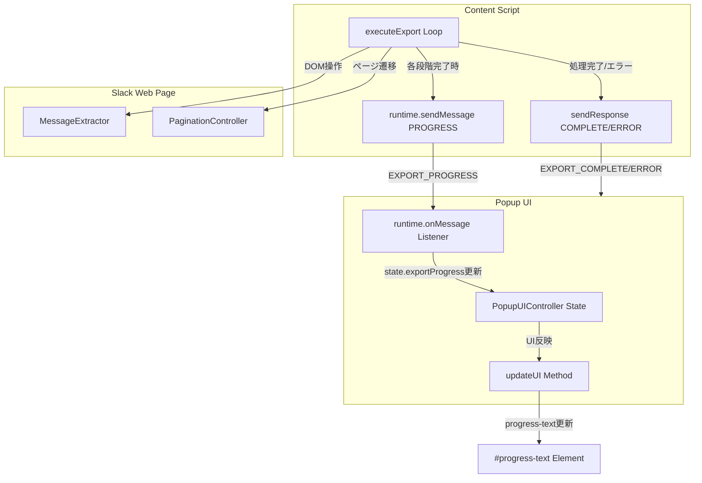
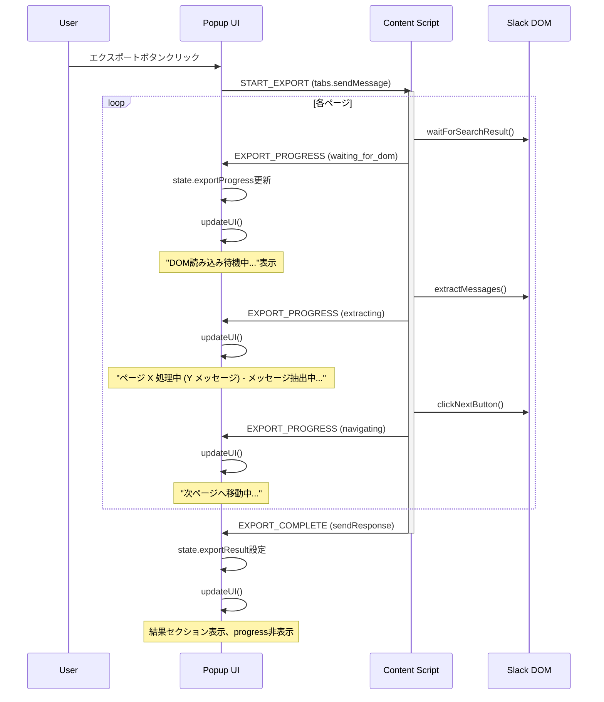

# Design Document

## Overview

本機能はSlack Search Result Exporter Chrome拡張機能にリアルタイムプログレス表示を追加します。現在、エクスポート処理は開始から完了までユーザーに進捗情報を提供しません。この機能により、現在処理中のページ数、累計メッセージ数、処理段階（DOM待機、抽出、ページ遷移）をPopup UIに表示し、ユーザー体験を向上させます。

**Purpose**: エクスポート処理の透明性を高め、ユーザーに進捗状況と完了までの目安を提供する。

**Users**: Slack Search Result Exporterを使用する全ユーザー。長時間のエクスポート処理（複数ページ）で特に有用。

**Impact**: 既存のエクスポートワークフローを拡張。UI要素とメッセージング機構に新規プログレス通知機能を追加。既存の完了/エラー通知機構は変更なし。

### Goals
- Content ScriptからPopupへのリアルタイムプログレス通知機能実装
- 既存`#progress`UI要素を活用した動的進捗表示（ページ数、メッセージ数、処理段階）
- TypeScript型安全性の維持（`ExportProgress`型定義、`ExportStatus` Union型）
- 既存エクスポート機能への影響を最小化（パフォーマンスオーバーヘッド < 50ms/ページ）

### Non-Goals
- プログレスバー（視覚的進捗率表示）の追加 — 将来検討
- エクスポートキャンセル機能 — 別スペックで検討
- 予想完了時間表示 — ページ数が事前に不明なため実装困難
- エクスポート履歴の保存 — スコープ外

## Architecture

### Existing Architecture Analysis

現在のChrome Extension構成:
- **Content Script** (`src/content-script.ts`): Slack DOMを操作し、メッセージ抽出とページネーション処理を実行。`executeExport()`メソッドがコアロジック。
- **Popup UI** (`src/popup.ts`): ユーザーインターフェース。`PopupUIController`クラスが状態管理と`updateUI()`によるDOM更新を担当。
- **Service Worker** (`src/service-worker.ts`): 設定保存とメッセージルーティング（本機能では未使用）。
- **メッセージング**:
  - Popup → Content Script: `chrome.tabs.sendMessage()`でコマンド送信（`START_EXPORT`, `APPLY_DATE_PRESET`）
  - Content Script → Popup: `sendResponse()`コールバックで結果返却（`EXPORT_COMPLETE`, `EXPORT_ERROR`）

**現在の制約**:
- `sendResponse()`は1回のみ呼び出し可能（最終結果専用）
- 中間プログレス通知の機構が存在しない

**統合ポイント**:
- Content Scriptの`executeExport()`ページネーションループ（src/content-script.ts:142-158）
- Popup UIの`PopupUIState`と`updateUI()`メソッド（src/popup.ts:337-364）
- `types.ts`の既存`EXPORT_PROGRESS`型定義（現在未使用）

### Architecture Pattern & Boundary Map

**選定パターン**: Pub-Subメッセージングパターン（Chrome Extension runtime messaging）

**統合方針**:
- 既存の`sendResponse()`パターンを維持（最終結果専用）
- 新規に`chrome.runtime.sendMessage()`を追加（プログレス通知専用）
- Content ScriptとPopup UIの責任境界を明確化



**既存パターン維持**:
- IIFE encapsulation（Content Script）
- Class-based state management（Popup UI）
- TypeScript strict mode、discriminated unions（型安全性）

**新規コンポーネント理由**:
- `ExportProgress`型: 既存の未定義payloadを正式定義し、型安全性確保
- `ExportStatus`型: 処理段階を型レベルで制限
- `runtime.onMessage`リスナー: プログレスメッセージ受信専用

**Steering準拠**:
- Vanilla TypeScript（フレームワーク不使用）
- Promise-based async/await
- Null checks、graceful degradation

### Technology Stack

| Layer | Choice / Version | Role in Feature | Notes |
|-------|------------------|-----------------|-------|
| Frontend | TypeScript 5.9.3 | 型定義拡張（ExportProgress, ExportStatus） | 既存strict mode維持 |
| Messaging | Chrome Extension API (Manifest V3) | chrome.runtime.sendMessage() for progress | tabs.sendMessage()と併用 |
| UI | HTML/CSS (既存) | #progress要素、#progress-text動的更新 | CSS変更不要 |
| Runtime | esbuild 0.27.2 | bundling (content-script.ts, popup.ts) | 既存ビルドプロセス維持 |

**新規依存なし** — 既存Chrome Extension APIとTypeScriptのみ使用

## System Flows

### プログレス通知シーケンス



**フロー決定事項**:
- プログレスメッセージは`runtime.sendMessage()`で非同期送信（最終結果をブロックしない）
- Popup側リスナーは`chrome.runtime.onMessage`で登録（全メッセージタイプを受信）
- 各段階で`status`フィールドにより表示文言を切り替え

## Requirements Traceability

| Requirement | Summary | Components | Interfaces | Flows |
|-------------|---------|------------|------------|-------|
| 1.1 | プログレス情報送信 | ContentScript.executeExport | ExportProgress | プログレス通知シーケンス |
| 1.2 | メッセージペイロード定義 | ExportProgress型 | ExportProgress | - |
| 1.3-1.5 | ステータス別送信 | ContentScript.executeExport | ExportStatus | プログレス通知シーケンス |
| 1.6 | 各段階でメッセージ送信 | ContentScript.executeExport | runtime.sendMessage | プログレス通知シーケンス |
| 2.1 | プログレス受信 | PopupUIController.onMessage | runtime.onMessage | プログレス通知シーケンス |
| 2.2 | 状態フィールド定義 | PopupUIState.exportProgress | ExportProgress | - |
| 2.3 | UI再描画トリガー | PopupUIController.updateUI | - | プログレス通知シーケンス |
| 2.4 | 受信失敗時の処理 | PopupUIController.onMessage | - | - |
| 3.1-3.8 | UI表示制御 | PopupUIController.updateUI | HTMLDivElement | プログレス通知シーケンス |
| 4.1-4.4 | 型定義拡張 | types.ts全体 | ExportProgress, ExportStatus | - |
| 5.1-5.5 | 既存機能互換性 | 全コンポーネント | - | - |

## Components and Interfaces

| Component | Domain/Layer | Intent | Req Coverage | Key Dependencies (P0/P1) | Contracts |
|-----------|--------------|--------|--------------|--------------------------|-----------|
| ExportProgress型 | Types | プログレス情報の型定義 | 1.2, 4.1 | - | State |
| ExportStatus型 | Types | 処理段階の型定義 | 1.3-1.5, 4.2 | - | State |
| ContentScript.executeExport拡張 | Content Script | プログレス送信ロジック | 1.1, 1.6 | chrome.runtime (P0) | Service |
| PopupUIController.onMessage | Popup UI | プログレス受信ハンドラー | 2.1, 2.4 | chrome.runtime (P0) | Event |
| PopupUIState.exportProgress | Popup UI | プログレス状態保持 | 2.2 | - | State |
| PopupUIController.updateUI拡張 | Popup UI | 動的プログレス表示 | 2.3, 3.1-3.8 | DOM Elements (P0) | Service |

### Types Layer

#### ExportProgress型

| Field | Detail |
|-------|--------|
| Intent | プログレスメッセージのpayload型を正式定義 |
| Requirements | 1.2, 4.1 |

**Responsibilities & Constraints**
- プログレス情報の構造を定義（currentPage, messageCount, status）
- 型安全性を確保（TypeScript strict mode）
- 不変型（immutable interface）

**Dependencies**
- Inbound: ContentScript, PopupUIController — payload型として参照 (P0)
- Outbound: ExportStatus — status型として依存 (P0)

**Contracts**: State [x]

##### State Management
```typescript
export type ExportStatus = "waiting_for_dom" | "extracting" | "navigating";

export interface ExportProgress {
  currentPage: number;    // 1-based page number
  messageCount: number;   // 累計メッセージ数
  status: ExportStatus;   // 現在の処理段階
}
```

**Implementation Notes**
- Integration: types.tsに追加、既存の`ContentScriptToPopupMessage`型のpayload更新
- Validation: Union型によりstatus値を制限
- Risks: なし（既存コードへの破壊的変更なし）

#### ContentScriptToPopupMessage型拡張

| Field | Detail |
|-------|--------|
| Intent | EXPORT_PROGRESSメッセージのpayload型をExportProgressに更新 |
| Requirements | 4.3 |

**State Management**
```typescript
export type ContentScriptToPopupMessage =
  | { type: "EXPORT_PROGRESS"; payload: ExportProgress }  // ← payload型更新
  | { type: "EXPORT_COMPLETE"; payload: ExportResult }
  | { type: "EXPORT_ERROR"; error: ExportError }
  | { type: "PRESET_APPLIED"; success: boolean; message?: string };
```

**Implementation Notes**
- Integration: 既存の型定義（types.ts:73-77）のpayloadを`ExportProgress`型に置換
- Validation: Discriminated unionパターン維持
- Risks: なし

### Content Script Layer

#### ContentScript.executeExport拡張

| Field | Detail |
|-------|--------|
| Intent | ページネーションループ内にプログレス送信ロジックを追加 |
| Requirements | 1.1, 1.3-1.6 |

**Responsibilities & Constraints**
- 各処理段階（DOM待機、抽出、ページ遷移）完了時にプログレスメッセージ送信
- 送信失敗時もエクスポート処理を継続（要件5.2）
- パフォーマンス要件遵守（< 50ms/ページ、要件5.1）

**Dependencies**
- Inbound: PopupUIController → START_EXPORTメッセージトリガー (P0)
- Outbound: chrome.runtime.sendMessage — プログレスメッセージ送信 (P0)
- Outbound: MessageExtractor, PaginationController — 既存依存維持 (P0)

**Contracts**: Service [x]

##### Service Interface
```typescript
// 既存executeExportメソッドの拡張（署名変更なし）
async executeExport(_options: ExportOptions): Promise<Result<ExportResult, ExportError>> {
  // ... 既存初期化ロジック ...

  while (messagePack.hasNextPage) {
    // 新規: DOM待機前にプログレス送信
    this.sendProgress(pageCount, messagePack.messages.length, "waiting_for_dom");

    await this.messageExtractor.waitForSearchResult();

    // 新規: 抽出前にプログレス送信
    this.sendProgress(pageCount, messagePack.messages.length, "extracting");

    do {
      await this.paginationController.waitMilliseconds(800);
      await this.messageExtractor.extractMessages(messagePack);
    } while (messagePack.messagePushed === true);

    pageCount++;

    // 新規: ページ遷移前にプログレス送信
    this.sendProgress(pageCount, messagePack.messages.length, "navigating");

    await this.paginationController.clickNextButton(messagePack);
    // ... 既存ロジック継続 ...
  }
}

// 新規プライベートメソッド
private sendProgress(currentPage: number, messageCount: number, status: ExportStatus): void {
  try {
    const chromeAPI = window.chrome || chrome;
    const message: ContentScriptToPopupMessage = {
      type: "EXPORT_PROGRESS",
      payload: { currentPage, messageCount, status }
    };
    chromeAPI.runtime.sendMessage(message);
  } catch (error) {
    // 送信失敗をログ記録のみ、処理継続（要件5.2）
    console.warn("Progress message send failed:", error);
  }
}
```

**Preconditions**:
- Content Script正常初期化済み
- chrome.runtime API利用可能

**Postconditions**:
- プログレスメッセージがPopupに送信される（失敗時も処理継続）
- executeExport()の戻り値と既存動作は変更なし

**Invariants**:
- currentPageは1以上
- messageCountは0以上
- statusはExportStatus型の値のみ

**Implementation Notes**
- Integration: src/content-script.tsのexecuteExport()メソッド内にsendProgress()呼び出し追加
- Validation: try-catchでruntime.sendMessage()をラップ、エラー時はログのみ
- Risks: 送信頻度（3回/ページ）が高負荷環境で問題になる可能性（実測で問題なし想定）

### Popup UI Layer

#### PopupUIState.exportProgress拡張

| Field | Detail |
|-------|--------|
| Intent | プログレス情報を保持する状態フィールド追加 |
| Requirements | 2.2, 4.4 |

**State Management**
```typescript
interface PopupUIState {
  selectedPreset: DatePreset;
  isExporting: boolean;
  exportResult: ExportResult | null;
  error: ExportError | null;
  exportProgress: ExportProgress | null;  // ← 新規追加
}
```

**Implementation Notes**
- Integration: src/popup.tsのPopupUIState型定義に追加
- Validation: null許容型（初期状態とエクスポート非実行時）
- Risks: なし

#### PopupUIController.setupProgressListener

| Field | Detail |
|-------|--------|
| Intent | プログレスメッセージ受信リスナーを設定 |
| Requirements | 2.1, 2.4 |

**Contracts**: Event [x]

##### Event Contract
- Published events: なし
- Subscribed events: `EXPORT_PROGRESS`（`chrome.runtime.onMessage`経由）
- Ordering / delivery guarantees: Chrome Extension runtime保証（メッセージ順序保証なし、到達保証あり）

```typescript
private setupProgressListener(): void {
  chrome.runtime.onMessage.addListener(
    (message: ContentScriptToPopupMessage) => {
      if (message.type === 'EXPORT_PROGRESS') {
        this.state.exportProgress = message.payload;
        this.updateUI();
      }
      // 他のメッセージタイプは無視（既存リスナーで処理）
    }
  );
}
```

**Implementation Notes**
- Integration: constructor()からsetupProgressListener()を呼び出し
- Validation: Type guard（`message.type === 'EXPORT_PROGRESS'`）でメッセージフィルタリング
- Risks: Popup閉鎖時のメッセージロスト（許容、再オープン時は最終結果のみ表示）

#### PopupUIController.updateUI拡張

| Field | Detail |
|-------|--------|
| Intent | プログレス情報に基づき#progress-text要素を動的更新 |
| Requirements | 2.3, 3.1-3.8 |

**Responsibilities & Constraints**
- `state.exportProgress`の値に基づき進捗テキスト生成
- statusに応じた補足メッセージ表示
- 既存のスピナーアニメーション維持
- エクスポート完了時はprogress要素非表示

**Contracts**: Service [x]

##### Service Interface
```typescript
private updateUI(): void {
  // 既存: エクスポート中フラグに基づくprogress表示制御
  if (this.state.isExporting) {
    this.elements.progress.style.display = 'flex';

    // 新規: プログレス情報がある場合、詳細テキスト表示
    if (this.state.exportProgress) {
      const { currentPage, messageCount, status } = this.state.exportProgress;
      let statusText = '';

      switch (status) {
        case 'waiting_for_dom':
          statusText = ' - DOM読み込み待機中...';
          break;
        case 'extracting':
          statusText = ' - メッセージ抽出中...';
          break;
        case 'navigating':
          statusText = ' - 次ページへ移動中...';
          break;
      }

      this.elements.progressText.textContent =
        `ページ ${currentPage} 処理中 (${messageCount} メッセージ)${statusText}`;
    } else {
      // フォールバック: プログレス情報なし時は既存テキスト
      this.elements.progressText.textContent = 'エクスポート中...';
    }

    // 既存: 他要素非表示
    this.elements.resultSection.style.display = 'none';
    this.elements.errorMessage.style.display = 'none';
  } else {
    // 既存: エクスポート完了/未実行時はprogress非表示
    this.elements.progress.style.display = 'none';
    this.state.exportProgress = null;  // 新規: プログレス状態リセット
  }

  // ... 既存の結果セクション・エラー表示ロジック継続 ...
}
```

**Implementation Notes**
- Integration: 既存のupdateUI()メソッド内にプログレステキスト生成ロジック追加
- Validation: `state.exportProgress`のnullチェック（フォールバック動作）
- Risks: DOM更新頻度（3回/ページ）による再描画コスト（textContent更新のみで軽量）

## Data Models

### Domain Model

**エンティティ**:
- `ExportProgress`: プログレス情報の値オブジェクト（不変）

**属性**:
- `currentPage: number` — 現在処理中のページ番号（1-based）
- `messageCount: number` — 累計抽出メッセージ数
- `status: ExportStatus` — 処理段階（"waiting_for_dom" | "extracting" | "navigating"）

**ビジネスルール**:
- currentPageは常に1以上
- messageCountは非負整数
- statusは3つの値のいずれか（型レベルで強制）

### Data Contracts & Integration

**メッセージスキーマ**:
```typescript
// Content Script → Popup プログレスメッセージ
{
  type: "EXPORT_PROGRESS",
  payload: {
    currentPage: number,    // 1, 2, 3, ...
    messageCount: number,   // 0, 5, 12, ...
    status: "waiting_for_dom" | "extracting" | "navigating"
  }
}
```

**バリデーション**:
- TypeScript型システムによる静的検証
- Popup側でType guard（`message.type === 'EXPORT_PROGRESS'`）による動的検証

**シリアライゼーション**:
- JSON（Chrome Extension runtime自動処理）
- 送信: `chrome.runtime.sendMessage(message)`
- 受信: `chrome.runtime.onMessage.addListener((message) => ...)`

## Error Handling

### Error Strategy

プログレス表示機能固有のエラー戦略:
- **送信失敗**: Content Script側でtry-catchによりcatch、ログ記録のみで処理継続（要件5.2）
- **受信失敗/Popup閉鎖**: 許容、次回Popup再オープン時は最終結果のみ表示
- **UI更新エラー**: nullチェックによりフォールバック動作（既存テキスト「エクスポート中...」表示）

### Error Categories and Responses

**System Errors** (Content Script):
- `runtime.sendMessage()`失敗 → console.warn()でログ記録、executeExport()処理継続
- chrome API未利用可能 → try-catchで捕捉、graceful degradation（プログレス表示なしでエクスポート継続）

**User Errors**:
- なし（プログレス表示は自動処理、ユーザー入力不要）

**Business Logic Errors**:
- なし（プログレス情報は参照のみ、状態遷移なし）

### Monitoring

- Content Script: プログレス送信失敗時のconsole.warn()ログ
- Popup UI: 受信メッセージのtype guardミスマッチ時のログ（既存パターン）
- パフォーマンス: ブラウザDevToolsのPerformanceタブで送信オーバーヘッド計測可能

## Testing Strategy

### Unit Tests
- `ExportProgress`型定義の検証（TypeScript型チェック）
- `sendProgress()`メソッドのモックテスト（chrome.runtime.sendMessage呼び出し検証）
- `updateUI()`メソッドのDOM更新検証（JSDOMまたはPlaywright）
- Type guardのテスト（`isContentScriptResponse()`でEXPORT_PROGRESS型判別）
- ステータス別テキスト生成ロジック（switch文の各caseカバレッジ）

### Integration Tests
- Content Script → Popup間のメッセージングフロー（Playwright E2E）
  - START_EXPORT送信 → EXPORT_PROGRESS受信 → updateUI()呼び出し確認
  - 複数ページエクスポート時のプログレス更新シーケンス
- エラーハンドリング統合テスト
  - runtime.sendMessage()失敗時の処理継続確認
  - Popup閉鎖中のメッセージ送信（エラーなく完了確認）

### E2E Tests
- 実際のSlack検索結果ページでの動作確認
  - プログレステキストの動的更新（「ページ X 処理中 (Y メッセージ)」）
  - ステータス文言の切り替え（DOM待機 → 抽出 → 遷移）
  - スピナーアニメーション維持確認
  - 完了時のprogress要素非表示、結果セクション表示
- 既存機能のリグレッションテスト
  - エクスポート完了時の最終結果表示（messageCount, pageCount一致）
  - エラー時の部分データ保持（EXPORT_ERROR.partialData）
  - 日付プリセット適用機能（APPLY_DATE_PRESET）

### Performance Tests
- メッセージ送信オーバーヘッド計測（要件5.1: < 50ms/ページ）
  - 10ページエクスポート時の総オーバーヘッド < 500ms
- DOM更新頻度による再描画コスト計測
  - textContent更新のみ（リフローなし）を確認

## Optional Sections

### Performance & Scalability

**Target Metrics**:
- プログレスメッセージ送信オーバーヘッド: < 10ms/回（3回/ページ = < 30ms/ページ）
- UI更新（textContent書き換え）: < 5ms/回
- 総オーバーヘッド: < 50ms/ページ（要件5.1）

**最適化戦略**:
- 非同期送信（`runtime.sendMessage()`はノンブロッキング）
- DOM更新最小化（textContentのみ変更、レイアウト再計算なし）
- 送信頻度制限（3回/ページ、高頻度ではない）

**スケーラビリティ**:
- 大量ページ（100ページ以上）でも線形スケール（ページごとの処理は独立）
- メモリフットプリント: ExportProgressオブジェクト1個のみ保持（state.exportProgress）

### Security Considerations

**既存セキュリティモデル維持**:
- Content Security Policy（manifest.json）変更なし
- chrome.runtime APIのみ使用（外部通信なし）
- XSS対策: プログレステキストは数値と固定文言のみ（ユーザー入力なし）

**新規リスク**:
- なし（プログレス情報は内部データのみ、外部入力なし）
